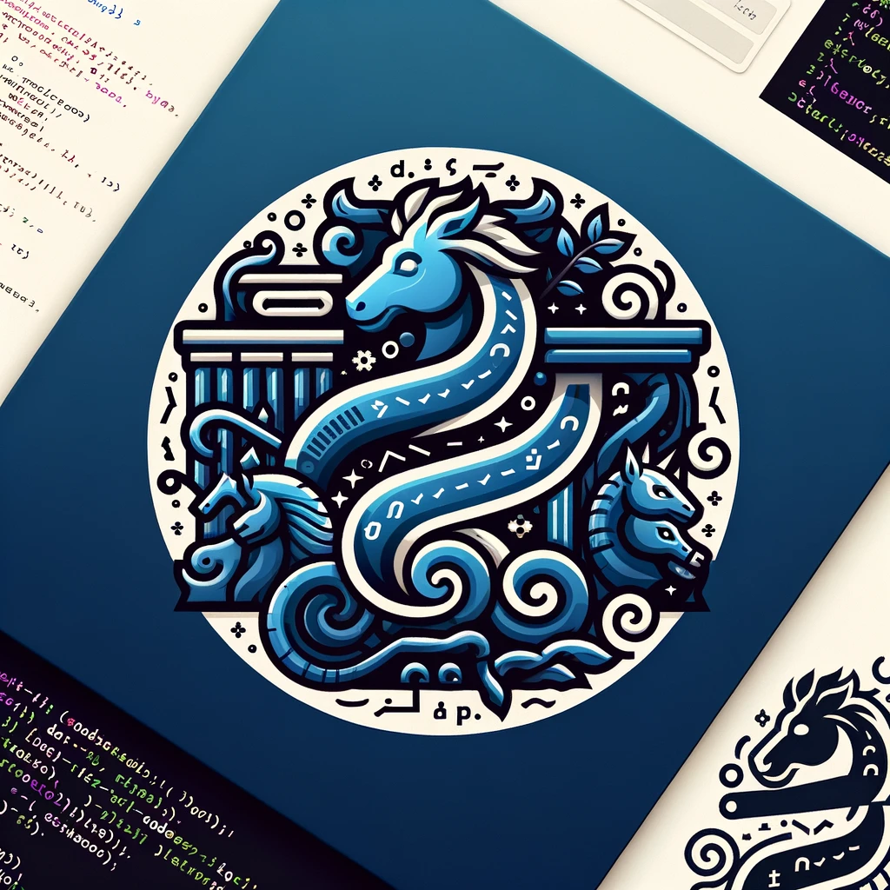

## `Mythos Code`

 

[MythosCode](#mythoscode) •
[Inspiration](#inspiration) •
[Structure](#structure) •
[How to Use](#how-to-use) •
[Contribute](#contribute) •
[Acknowledgments](#acknowledgments) •
[TODO](#todo)

### MythosCode
Welcome to **MythosCode**, a repository where ancient myths, timeless fables, and epic tales are reimagined through the lens of modern programming languages. Each file in this collection represents a unique story, transformed into a function or series of functions, coded in a variety of programming languages to capture the essence, moral, and intrigue of the original narratives.

### Inspiration
The idea behind MythosCode is to explore how the universal themes and lessons of classic stories can be expressed in the structured logic of code. This project is a tribute to the timeless nature of storytelling, showcasing the creativity and flexibility of programming as a medium for narrative.

### Structure
The repository is now somewhat organized.

### How to Use
1. Clone the repository to your local machine.
2. Navigate to the language-specific directory of your choice.
3. Open a tale. Each file includes comments (TODO) explaining the story and how the code relates to it.

### Contribute
MythosCode is an open canvas, and contributions are welcome! If you have a story you'd like to code or see coded, feel free to open an issue or submit a pull request. Whether it's a well-known myth or an obscure fable, we're excited to see how you bring it to life with code.

### Acknowledgments
A huge thank you to all contributors and to the myriad cultures and storytellers whose enduring works continue to inspire and teach us.

### TODO
Push me Pull me.